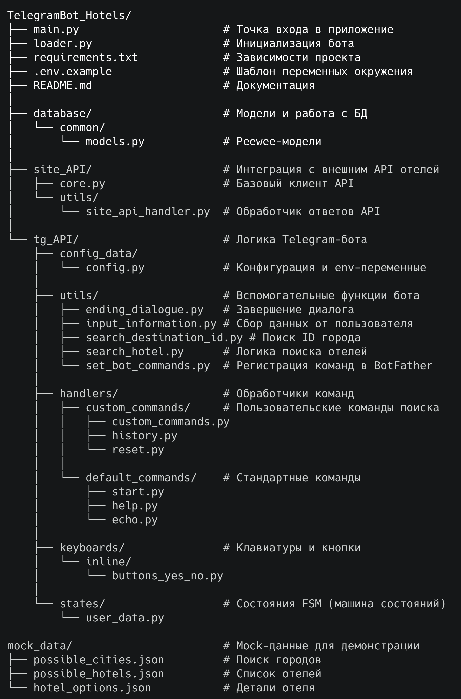

# 🏨 Телеграмм-БОТ компании "HotelsTravel" по подбору отелей.

**TelegramBot_Hotels — это телеграм-бот, который помогает пользователям находить отели по всему миру через удобный интерфейс Telegram.**
## 🛠 Технологический стек
- **Язык программирования**: Python 3.9+
- **ORM**: Peewee
- **База данных**: SQLite
- **Telegram API**: pyTelegramBotAPI
- **Библиотеки**: Pydantic, Requests, python-dotenv, Loguru, python-telegram-bot-calendar

## 📁 Структура проекта

## 🚀 Установка и запуск
### 1. Клонирование репозитория
`git clone git@github.com:skurkova/TelegramBot_Hotels.git`

`cd TelegramBot_Hotels`
### 2. Создание и активация виртуального окружения
`python3 -m venv venv`

`source venv/bin/activate`
### 3. Установка зависимостей
`pip install -r requirements.txt`

### 4. Настройка окружения
- `cp .env.example .env`
- отредактируйте `.env`, добавив свои ключи

### 5. Запуск приложения
`python3 main.py`

## ▶️ Использование

**Начало работы Telegram-БОТa**:
1. Найдите бота в Telegram: @HotelsTravel.
2. Нажмите `Начать` или выберете в `МЕНЮ` → `Запустить бота` ***'/start'***.
3. Далее следуйте инструкциям БОТа.

При выборе соответствующего пункта `МЕНЮ` БОТ-помощник предоставит информацию по следующим пунктам:
- `Самые дешёвые отели` ***'/lowprice'*** 
- `Самые дорогие отели` ***'/highprice'*** 
- `Наиболее подходящие отели по расположению от центра города` ***'/customlocation'*** 
- `История поиска отелей` ***'/history'*** 
- `Вывести справку` ***'/help'*** 
- `Начать с начала` ***'/reset'***